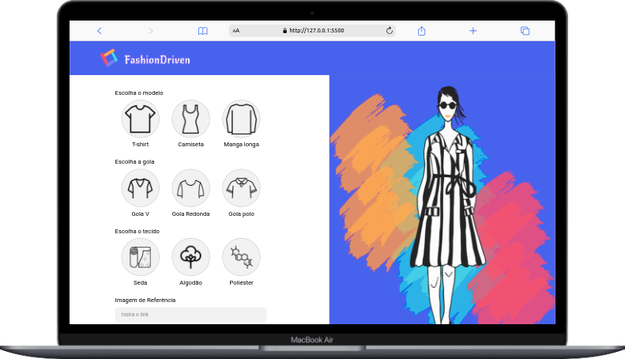

<h1>FashionDriven</h1>

FashionDriven is a web page built using HTML, CSS, and JavaScript, designed for purchasing custom shirts. The platform provides users with a range of customization options, allowing them to choose the shirt type, collar style, fabric, and even upload a reference image for further personalization. Additionally, users have the option to buy pre-designed shirts from the latest orders. Explore the world of personalized fashion with FashionDriven!

  
  

## 🔨 Features

- `Feature 1`: Upon entering the website, the user is prompted to enter their name. Subsequently, they are free to choose the model, collar type, fabric, and can provide a link to an image to enhance the understanding of the clothing style.
- `Feature 1a`: To submit the clothing model, it is necessary to click the "Confirm Order" button. However, the button will only be enabled if the user has correctly followed all previous steps.
- `Feature 2`: Further down the screen, there is a history with the site's recent orders, along with the names of the creators of the clothing models. The user can place the same registered order by simply clicking on the desired one. relacionada à funcionalidade 2

## 🛠️ Open and run the project

- 📁 The FashionDriven project is open source and easily accessible through the link: https://github.com/Teones/Projeto---Fashion-Driven. 
- ▶️ To run the project, it has also been deployed at the following link: https://teones.github.io/Projeto---Fashion-Driven/.

## ✔️ Techniques and technologies used

